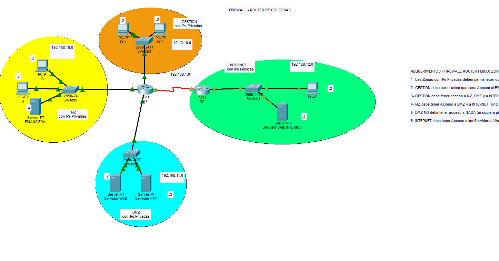

# networks_portfolio

# Implementación de Firewall Router con DMZ, NAT y ACL

## Arquitectura de seguridad perimetral empresarial con Cisco Packet Tracer

Proyecto académico de Networking orientado al diseño y simulación de una arquitectura de red empresarial utilizando dispositivos Cisco.

La solución implementa un **Firewall Router** como punto central de control entre las zonas de **Gestión, MZ, DMZ e Internet**, incorporando mecanismos de **routing, NAT, NAT estático, ACL y SSH** para controlar la comunicación entre los diferentes segmentos de red.

---

## 1. Descripción del proyecto

El proyecto representa una arquitectura empresarial segmentada en diferentes zonas de seguridad, cada una con una función específica dentro de la infraestructura.

La arquitectura contempla:

- **Gestión:** zona destinada a la administración de los dispositivos de red.
- **MZ:** red interna donde se encuentran los usuarios y recursos corporativos.
- **DMZ:** zona destinada a servidores y servicios que requieren comunicación con redes externas.
- **Internet:** red externa utilizada para validar la conectividad y el acceso a los servicios publicados.

El diseño permite establecer diferentes políticas de comunicación entre las zonas mediante mecanismos de routing, traducción de direcciones y listas de control de acceso.

---

## 2. Objetivo

Diseñar e implementar una arquitectura de red empresarial segmentada mediante un Firewall Router Cisco, aplicando mecanismos de enrutamiento, NAT y control de acceso para regular la comunicación entre diferentes zonas de seguridad.

### Objetivos específicos

- Diseñar una arquitectura segmentada en zonas de Gestión, MZ, DMZ e Internet.
- Configurar direccionamiento IPv4.
- Configurar interfaces de los dispositivos de red.
- Implementar routing entre diferentes segmentos.
- Implementar RIP versión 2.
- Configurar NAT/PAT para la comunicación hacia redes externas.
- Implementar NAT estático para publicar servicios ubicados en la DMZ.
- Implementar ACL para controlar el tráfico entre zonas.
- Configurar administración remota mediante SSH.
- Validar los flujos de tráfico permitidos y restringidos.
- Comprobar el acceso a los servicios Web y FTP ubicados en la DMZ.

---

# 3. Arquitectura de red

La arquitectura utiliza un router Cisco como punto central de comunicación entre las diferentes zonas.

### Zonas principales

| Zona | Red | Función |
|---|---|---|
| MZ | `192.168.10.0/24` | Red interna de usuarios y recursos |
| Gestión | `10.10.10.0/24` | Administración de dispositivos de red |
| Internet | `192.168.12.0/24` | Segmento de red externa |
| Enlace entre routers | `192.168.1.0/24` | Comunicación entre routers |

La DMZ se utiliza para alojar los servicios destinados a ser publicados hacia redes externas.

La separación de las zonas permite aplicar políticas de acceso diferentes dependiendo del origen y destino del tráfico.

---

# 4. Direccionamiento

En el router principal se configuraron interfaces para conectar los diferentes segmentos de la arquitectura.

Entre las interfaces documentadas se encuentran:

| Dispositivo | Interfaz | Dirección IP |
|---|---|---|
| R1 | FastEthernet0/0 | `192.168.10.1/24` |
| R1 | FastEthernet0/1 | `192.168.11.1/24` |
| R1 | FastEthernet1/0 | `10.10.10.1/24` |
| R1 | Serial0/0/0 | `192.168.1.1/24` |

Estas interfaces permiten establecer la comunicación entre los diferentes segmentos y funcionan como gateways de las redes conectadas directamente al router.

---

# 5. Tecnologías utilizadas

### Networking

- Cisco IOS
- Cisco Packet Tracer
- IPv4
- Routing
- RIP v2
- NAT
- NAT/PAT
- NAT estático
- ACL
- DMZ
- SSH
- TCP/IP

### Servicios de red

- HTTP
- FTP
- SSH

---

# 6. Implementación técnica

## 6.1 Segmentación de red

La infraestructura se divide en diferentes zonas con funciones específicas.

### MZ

Representa la red interna de la organización y contiene los equipos de usuarios y recursos corporativos.

### Gestión

Corresponde al segmento destinado a la administración de los dispositivos de red.

El acceso administrativo se realiza mediante SSH y se controla mediante políticas de acceso.

### DMZ

La DMZ contiene servidores que requieren comunicación con redes externas.

La utilización de una zona independiente permite separar estos servicios de la red interna.

### Internet

Representa la red externa desde la cual se realizan las pruebas de acceso a los servicios publicados y las validaciones de las políticas de seguridad.

---

# 7. Conectividad y NAT

## 7.1 MZ hacia Internet

Se realizó una prueba de conectividad desde un equipo perteneciente a la MZ hacia la red externa.

### Resultado

La prueba permite verificar la comunicación desde la red interna hacia el segmento externo mediante los mecanismos de traducción configurados.

---

## 7.2 Tabla de traducciones NAT

Se verificaron las traducciones generadas por el router mediante la tabla de NAT.

La tabla permite observar las asociaciones entre las direcciones utilizadas por los equipos internos y las direcciones empleadas para la comunicación externa.

### Resultado

Se verificaron las entradas de traducción correspondientes a las conexiones realizadas desde la infraestructura.

---

# 8. DMZ y publicación de servicios

La DMZ contiene servicios destinados a proporcionar acceso controlado desde otras redes.

Dentro de la arquitectura se contemplan servicios como:

- Servidor Web.
- Servidor FTP.

La publicación de estos servicios se realiza mediante mecanismos de NAT estático, permitiendo establecer una correspondencia entre una dirección utilizada externamente y el servidor ubicado en la DMZ.

---

## 8.1 Comunicación MZ hacia DMZ

Se realizó una prueba de comunicación desde la red interna hacia la DMZ.

### Resultado

Se verificó la comunicación entre la MZ y la DMZ de acuerdo con las políticas configuradas.

---

## 8.2 Acceso Web desde MZ

Se realizó una prueba de acceso al servidor Web ubicado en la DMZ desde un equipo perteneciente a la red interna.

### Resultado

Se verificó el acceso al servicio Web desde la red interna.

---
## 8.3 Acceso Web desde Internet

Se realizó una prueba de acceso desde la red externa hacia el servidor Web ubicado en la DMZ.

El flujo de comunicación puede representarse conceptualmente de la siguiente manera:

Internet
   |
   v
Dirección pública
   |
   v
NAT estático
   |
   v
Servidor Web
   |
  DMZ

## 8.4 Acceso FTP desde Internet

Se realizó una prueba de acceso al servicio FTP ubicado en la DMZ desde la red externa.

La prueba permitió establecer una conexión con el servidor FTP ubicado en la DMZ y realizar la autenticación con las credenciales configuradas.

### Resultado

Se verificó la conexión desde Internet hacia el servicio FTP publicado en la DMZ.

---

# 9. Implementación de ACL

Se implementaron **Access Control Lists (ACL)** para controlar el tráfico entre las diferentes zonas de la arquitectura.

Las ACL permiten establecer políticas de acceso considerando:

- Dirección IP de origen.
- Dirección IP de destino.
- Protocolo.
- Servicio.
- Sentido del tráfico.

### Políticas de acceso implementadas

| Origen | Destino | Política |
|---|---|---|
| MZ | Internet | Permitido |
| MZ | DMZ | Permitido |
| Internet | MZ | Restringido |
| Internet | DMZ | Permitido para servicios publicados |
| Gestión | R1 | SSH permitido |
| MZ | R1 | SSH restringido |

Las ACL permiten aplicar políticas diferenciadas entre las zonas y limitar el acceso a los recursos de la infraestructura.

---

# 10. Restricción de acceso desde Internet hacia MZ

Se realizó una prueba de comunicación desde el segmento externo hacia la red interna.

### Resultado

La comunicación desde Internet hacia la red interna se encuentra restringida de acuerdo con las políticas de acceso implementadas.

También se documentó una prueba adicional de comunicación entre Internet y MZ:

Estas pruebas permiten verificar el comportamiento del tráfico entre la red externa y la red interna.

---

# 11. Administración mediante SSH

Se configuró administración remota mediante **Secure Shell (SSH)** para controlar el acceso administrativo al router.

El acceso administrativo se encuentra asociado a las políticas de seguridad implementadas para las diferentes zonas.

## 11.1 SSH desde Gestión

Se realizó una prueba de conexión SSH desde un equipo perteneciente a la zona de Gestión hacia R1.

### Resultado

La conexión SSH desde la zona de Gestión fue exitosa, verificando el acceso administrativo al router.

---

## 11.2 SSH desde MZ

Se realizó una prueba de conexión SSH desde un equipo perteneciente a la MZ hacia R1.

### Resultado

El intento de conexión SSH desde la MZ fue restringido.

Esta prueba permite comprobar que el acceso administrativo al router se encuentra controlado según el segmento de origen.

---

# 12. Routing

Se implementó routing para permitir la comunicación entre las diferentes redes de la arquitectura.

La solución utiliza **RIP versión 2** para el intercambio de información de routing entre los routers.

La tabla de routing permite identificar:

- Redes directamente conectadas.
- Redes remotas.
- Rutas aprendidas mediante el protocolo de routing.
- Siguiente salto utilizado para alcanzar redes remotas.

### Resultado

Se verificó la tabla de routing del router y la presencia de rutas necesarias para la comunicación entre los diferentes segmentos de la arquitectura.

La evidencia permite identificar las redes conectadas directamente y las rutas aprendidas mediante RIP.