# Proyecto 2 — Red empresarial con VLAN, DHCP y seguridad LAN

## Descripción

Diseño e implementación de una infraestructura LAN empresarial en Cisco Packet Tracer, orientada a la segmentación de usuarios mediante VLAN, comunicación entre redes, asignación dinámica de direcciones IP y aplicación de mecanismos básicos de seguridad de capa 2.


La arquitectura integra dos switches de acceso, un router Cisco, un servidor DHCP y equipos finales distribuidos en diferentes VLAN. El enrutamiento entre VLAN se implementa mediante **Router-on-a-Stick**, mientras que los enlaces troncales utilizan **802.1Q** para transportar múltiples VLAN.

El proyecto también incorpora **DHCP Relay mediante `ip helper-address`**, **Port Security con Sticky MAC** y **Spanning Tree Protocol (STP)** para fortalecer la disponibilidad y seguridad de la infraestructura LAN.

---

## Objetivos

- Diseñar una red LAN empresarial segmentada mediante VLAN.
- Implementar enlaces trunk utilizando encapsulación 802.1Q.
- Configurar comunicación entre diferentes VLAN mediante Router-on-a-Stick.
- Implementar DHCP Relay para permitir la asignación dinámica de direcciones IP.
- Configurar mecanismos de seguridad de acceso mediante Port Security y Sticky MAC.
- Verificar el funcionamiento de Spanning Tree Protocol.
- Validar la conectividad dentro de una misma VLAN y entre diferentes VLAN.

---

## Arquitectura de red

La topología está compuesta por:

- **R1:** router encargado del enrutamiento entre VLAN mediante subinterfaces.
- **S1:** switch de acceso.
- **S2:** switch de acceso.
- **Servidor DHCP:** proporciona direccionamiento dinámico a los clientes.
- **PCs:** equipos finales distribuidos entre las VLAN.
- **Servidor DNS:** servicio utilizado por los equipos de la infraestructura.

### Segmentación de red

| VLAN | Nombre | Red | Gateway |
|---|---|---|---|
| VLAN 10 | FIET | 10.0.0.0/8 | 10.0.0.1 |
| VLAN 20 | FIC | 20.0.0.0/8 | 20.0.0.1 |
| VLAN 99 | GESTION | 99.0.0.0/8 | 99.0.0.1 |

### Servicios principales

| Servicio | Dirección |
|---|---|
| Servidor DHCP | 100.0.0.10 |
| Servidor DNS | 200.0.0.50 |
| Gestión S1 | 99.0.0.11 |
| Gestión S2 | 99.0.0.12 |

---

## Tecnologías utilizadas

- Cisco Packet Tracer
- Cisco IOS
- VLAN
- 802.1Q Trunking
- Router-on-a-Stick
- Inter-VLAN Routing
- DHCP
- DHCP Relay
- `ip helper-address`
- Port Security
- Sticky MAC
- Spanning Tree Protocol (STP)
- IPv4
- Switching
- Segmentación de red
- Seguridad de capa 2

---

# Implementación técnica

## 1. Segmentación mediante VLAN

Se crearon VLAN independientes para separar los diferentes grupos de usuarios y la administración de la infraestructura.

### VLAN implementadas

```text
VLAN 10 → FIET
VLAN 20 → FIC
VLAN 99 → GESTION
```

La segmentación permite separar los dominios de broadcast y establecer una estructura organizada para la infraestructura LAN.

### Evidencia


---

## 2. Trunking 802.1Q

Los enlaces entre los dispositivos de red fueron configurados como enlaces troncales para transportar múltiples VLAN a través de una misma conexión física.

La configuración utiliza el estándar **802.1Q**, permitiendo identificar y transportar el tráfico correspondiente a las diferentes VLAN de la infraestructura.

Las VLAN utilizadas en la topología son:

```text
VLAN 10 → FIET
VLAN 20 → FIC
VLAN 99 → Gestión
```

Los enlaces troncales permiten transportar estas VLAN entre los dispositivos de red, manteniendo la segmentación lógica de la infraestructura.

### Evidencias

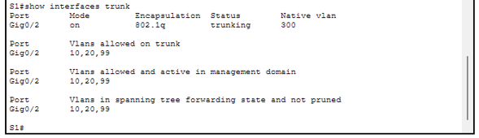

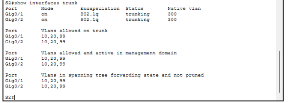

---

## 3. Inter-VLAN Routing mediante Router-on-a-Stick

El router **R1** implementa el enrutamiento entre VLAN mediante subinterfaces configuradas sobre la interfaz física `GigabitEthernet0/1`.

Esta arquitectura permite que diferentes redes VLAN se comuniquen utilizando el router como gateway de cada segmento.

### Subinterfaces configuradas

```text
GigabitEthernet0/1.10
    encapsulation dot1Q 10
    ip address 10.0.0.1 255.0.0.0

GigabitEthernet0/1.20
    encapsulation dot1Q 20
    ip address 20.0.0.1 255.0.0.0

GigabitEthernet0/1.99
    encapsulation dot1Q 99
    ip address 99.0.0.1 255.0.0.0
```

Cada subinterfaz funciona como gateway de su respectiva VLAN y permite el intercambio de tráfico entre redes lógicas diferentes.

### Evidencia

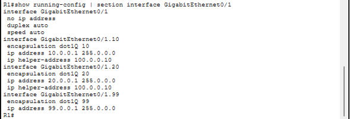

---

## 4. DHCP Relay

El servidor DHCP se encuentra separado de las VLAN de usuarios. Para permitir que las solicitudes DHCP sean enviadas desde las diferentes redes hacia el servidor, se implementó **DHCP Relay** mediante la configuración `ip helper-address`.

La dirección utilizada para reenviar las solicitudes DHCP es:

```text
ip helper-address 100.0.0.10
```

Esta configuración se encuentra asociada a las interfaces correspondientes a las VLAN de usuarios.

### Flujo de asignación

```text
PC
 |
 | Solicitud DHCP
 v
VLAN 10 / VLAN 20
 |
 v
R1 - DHCP Relay
 |
 | ip helper-address
 v
Servidor DHCP
100.0.0.10
```

De esta manera, los clientes pueden obtener automáticamente sus parámetros de red aunque el servidor DHCP se encuentre en una red diferente.

### Evidencia

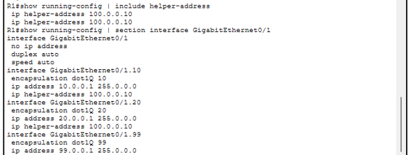

---

## 5. Servicio DHCP

El servidor DHCP fue configurado para proporcionar automáticamente los parámetros de red a los dispositivos clientes.

Para la VLAN 10 se configuró un pool con los siguientes parámetros:

```text
Default Gateway: 10.0.0.1
DNS Server: 200.0.0.50
Start IP: 10.0.0.201
Subnet Mask: 255.0.0.0
```

La asignación dinámica fue comprobada desde los equipos cliente.

Un ejemplo de los parámetros obtenidos por un cliente es:

```text
IPv4 Address: 10.0.0.201
Subnet Mask: 255.0.0.0
Default Gateway: 10.0.0.1
DNS Server: 200.0.0.50
```

El cliente confirma además:

```text
DHCP request successful
```

Esto permite verificar que el proceso de asignación dinámica está funcionando correctamente.

### Evidencias

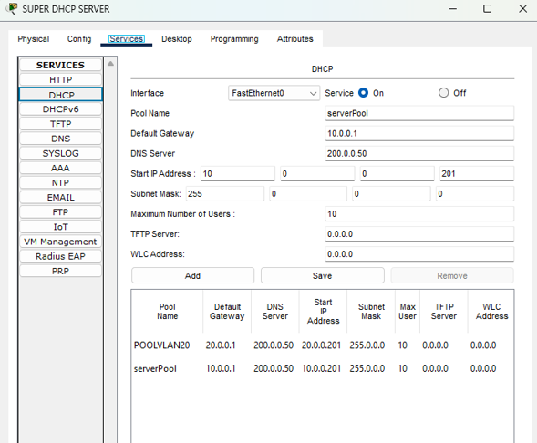

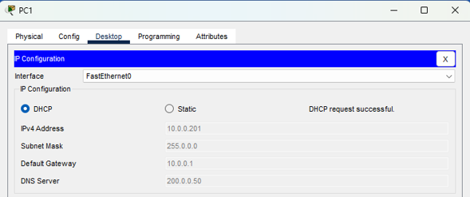

---

## 6. Port Security

Se implementó **Port Security** en puertos de acceso de los switches para controlar las direcciones MAC que pueden utilizar una interfaz determinada.

La configuración utilizada incluye:

```text
switchport mode access
switchport port-security
switchport port-security maximum 2
switchport port-security mac-address sticky
```

La configuración permite asociar dinámicamente las direcciones MAC aprendidas al puerto mediante **Sticky MAC** y establece un máximo de dos direcciones MAC.

La política definida para una violación de seguridad utiliza:

```text
Shutdown
```

### Estado verificado

En la verificación del puerto se observa:

```text
Port Security          : Enabled
Port Status            : Secure-up
Violation Mode         : Shutdown
Maximum MAC Addresses  : 2
Total MAC Addresses    : 2
Sticky MAC Addresses   : 2
Security Violation     : 0
```

Estos resultados permiten comprobar que Port Security se encuentra habilitado, que existen dos direcciones MAC asociadas al puerto y que no se han registrado violaciones de seguridad durante la prueba.

### Evidencias

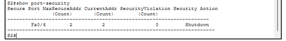

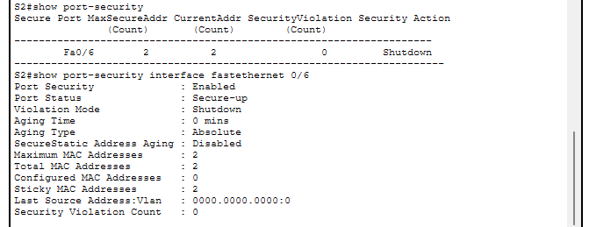

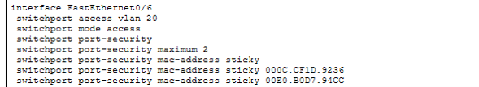

---

## 7. Spanning Tree Protocol

Se verificó la operación de **Spanning Tree Protocol (STP)** mediante el comando:

```text
show spanning-tree
```

La salida permite identificar información relacionada con:

- Root ID.
- Bridge ID.
- Root Port.
- Designated Ports.
- Roles de los puertos.
- Estados de los puertos.
- Estado Forwarding.

En la topología analizada, el puerto:

```text
GigabitEthernet0/2
```

se identifica como **Root Port** y se encuentra en estado **Forwarding**.

STP permite controlar la topología de capa 2 y evitar problemas derivados de posibles bucles en la red.

### Evidencia

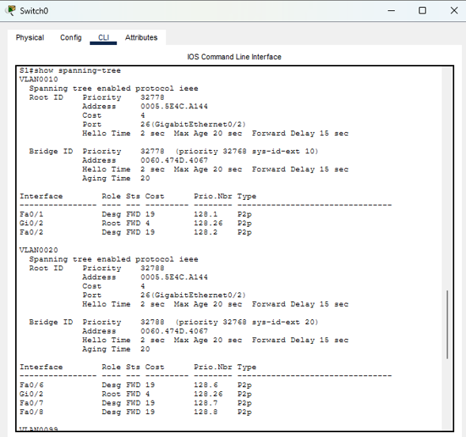

---

# Pruebas de funcionamiento

## 8. Conectividad dentro de la misma VLAN

Se verificó la comunicación entre equipos pertenecientes a una misma VLAN mediante pruebas de conectividad utilizando `ping`.

Esta prueba permite comprobar que los dispositivos pertenecientes al mismo dominio de broadcast pueden comunicarse correctamente.

Ejemplo:

```text
PC1 → PC5
```

La comunicación exitosa permite validar la conectividad dentro del mismo segmento lógico.

### Evidencia

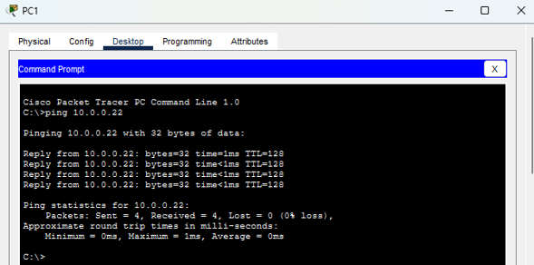

---

## 9. Conectividad Inter-VLAN

Se verificó la comunicación entre equipos pertenecientes a diferentes VLAN.

El flujo de comunicación puede representarse de la siguiente manera:

```text
PC VLAN 10
    |
    v
Switch
    |
    v
R1
    |
    v
Switch
    |
    v
PC VLAN 20
```

La comunicación entre las redes:

```text
10.0.0.0/8
```

y

```text
20.0.0.0/8
```

permite validar el funcionamiento del **Router-on-a-Stick** y del enrutamiento entre VLAN.

### Evidencia

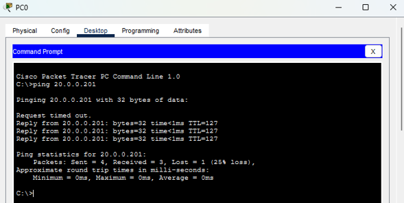

---

## 10. Conectividad mediante DHCP

Después de obtener automáticamente una dirección IP mediante DHCP, se verificó la conectividad del cliente con su gateway.

Ejemplo:

```text
IP: 10.0.0.201
Gateway: 10.0.0.1
```

La prueba de conectividad se realiza mediante:

```text
ping 10.0.0.1
```

Esta prueba permite validar conjuntamente la asignación de parámetros mediante DHCP y la comunicación del cliente con su gateway.

### Evidencia

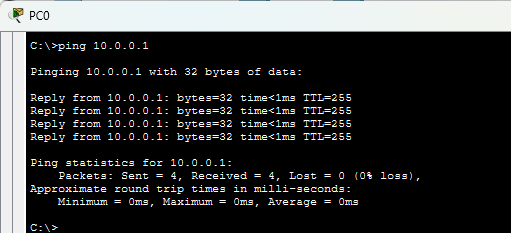

---

# Resultados

La implementación permitió validar diferentes componentes fundamentales de una infraestructura LAN empresarial:

| Componente | Resultado |
|---|---|
| Segmentación mediante VLAN | Implementado |
| VLAN 10, 20 y 99 | Verificadas |
| Trunking 802.1Q | Verificado |
| Router-on-a-Stick | Implementado |
| Inter-VLAN Routing | Verificado |
| DHCP Relay | Implementado |
| Asignación DHCP | Verificada |
| Port Security | Implementado |
| Sticky MAC | Verificado |
| STP | Verificado |
| Conectividad intra-VLAN | Verificada |
| Conectividad Inter-VLAN | Verificada |

---

# Competencias demostradas

Este proyecto demuestra competencias prácticas en:

- Diseño y segmentación de redes LAN.
- Configuración de VLAN.
- Switching Cisco.
- Configuración de enlaces trunk 802.1Q.
- Enrutamiento Inter-VLAN.
- Implementación de Router-on-a-Stick.
- Configuración y diagnóstico de DHCP.
- Implementación de DHCP Relay.
- Seguridad de puertos mediante Port Security.
- Gestión de direcciones MAC mediante Sticky MAC.
- Fundamentos de Spanning Tree Protocol.
- Diagnóstico básico de conectividad mediante ICMP.
- Configuración de dispositivos Cisco mediante Cisco IOS.

---

# Estructura del proyecto

```text
02-enterprise-lan-vlan-dhcp-security/
│
├── README.md
│
├── topology/
│   └── topology.pkt
│
└── evidence/
    ├── 01-topology.png
    ├── 02-vlan-s1.png
    ├── 02-vlan-s2.png
    ├── 03-trunk-configuration-s1.png
    ├── 03-trunk-configuration-s2.png
    ├── 04-inter-vlan-routing.png
    ├── 05-dhcp-relay.png
    ├── 06-dhcp-client-1.png
    ├── 06-dhcp-client-2.png
    ├── 07-port-security-1.png
    ├── 07-port-security-2.png
    ├── 07-port-security-3.png
    ├── 08-stp.png
    ├── 09-same-vlan-connectivity.png
    ├── 10-inter-vlan-connectivity.png
    └── 11-dhcp-connectivity.png
```

---

# Herramientas

- Cisco Packet Tracer
- Cisco IOS
- Command Line Interface (CLI)

---

# Tipo de proyecto

**Proyecto académico de Networking e Infraestructura TI**

**Área:** Telecomunicaciones · Networking · Infraestructura · Cisco

**Entorno:** Cisco Packet Tracer

---

# Palabras clave

`Cisco` `Networking` `LAN` `VLAN` `Switching` `802.1Q` `Trunking` `Router-on-a-Stick` `Inter-VLAN Routing` `DHCP` `DHCP Relay` `IP Helper` `Port Security` `Sticky MAC` `STP` `Cisco IOS` `Packet Tracer` `IPv4` `Network Security`